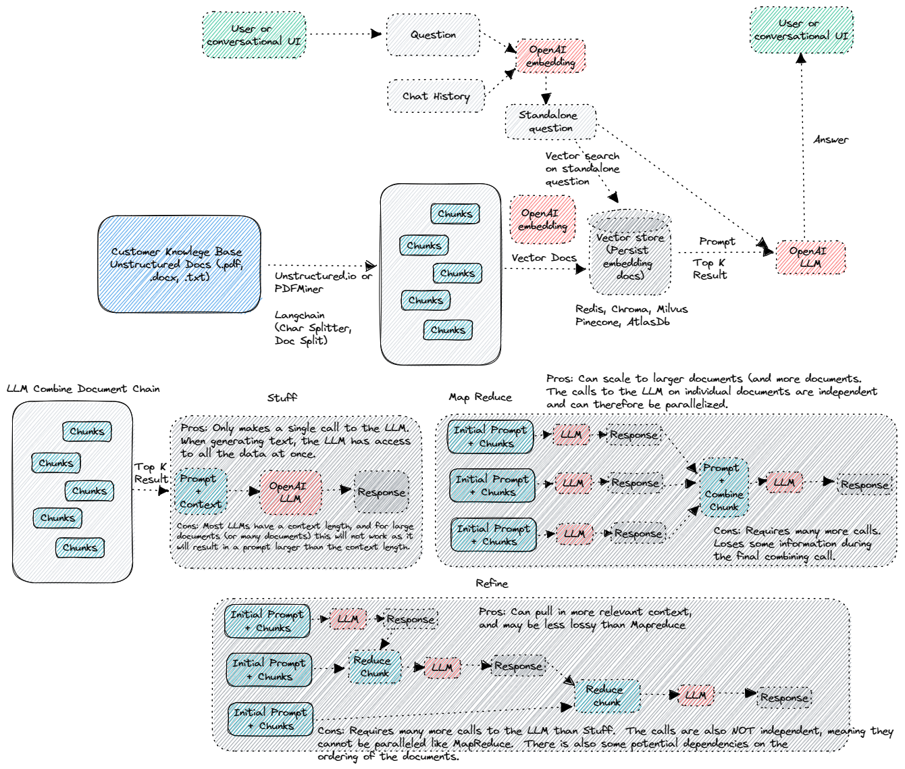

# ChatGPT + Enterprise data with Azure OpenAI

This accelerator demonstrates a few approaches for creating ChatGPT-like experiences over your own data using the Retrieval Augmented Generation pattern. It uses Azure OpenAI Service to access the ChatGPT model (gpt-35-turbo), and Azure Cognitive Search for data indexing and retrieval.

## Features

- Chat and Q&A interfaces
- Explores various options to help users evaluate the trustworthiness of responses with citations, tracking of source content, etc.
- Shows possible approaches for data preparation, prompt construction, and orchestration of interaction between model (ChatGPT) and retriever (Cognitive Search)
- Settings directly in the UX to tweak the behavior and experiment with options

### Chatting with your own data

The way you interact with large language models like ChatGPT is using natural language, giving the model a “prompt” and requesting it to complete it. This could be a question, a conversation turn, a pattern to extend, etc. When used this way, the responses you get are based on what the model has learned during training, which can be useful for general knowledge questions or an informal chat, but not what you want if you’re building an application where users should see responses based on your own data.

One approach to have ChatGPT generate responses based on your own data is simple: inject this information into the prompt. ChatGPT can read the information along with any instructions, context or questions, and respond accordingly. This approach doesn’t need retraining or fine-tuning of the model, and the responses can reflect any changes in the underlying data immediately.

This presents a new challenge though: these models have a limit on the “context length” they support (the current ChatGPT model can take up to 4000 tokens in a prompt), and even if they didn’t have those limits, it wouldn’t be practical to inject GBs worth of data into a text prompt in each interaction. The alternative is to keep all the data in an external knowledge base that can retrieve pieces quickly and with good relevance, exactly what Cognitive Search & Vector stores are designed for.

This retrieval-augmented generation approach opens the door for starting simple and getting more sophisticated as needed. There are many options for how to construct prompts, how to formulate queries for effective retrieval from the knowledge base, and how to orchestrate back-and-forth interaction between ChatGPT and the knowledge base. Before we dig into those, let’s talk about one more requirement: helping users validate that responses are trustworthy.

#### Generating trustworthy responses

We assume these large language models, prompts, and orchestration systems aren’t perfect, and see the responses generated by them as a candidate response that should include the right information for an end user to validate. As part of exploring this topic we implemented 3 simple experiences as starting points. That’s not to say these are the only ones; we welcome ideas and feedback on the best way to give users better tools to validate that results from the system are factually correct.

- Citations: Each statement in the response includes a citation with a link to the source content. You can see the citations in context (the superscript numbers) as well as the links at the bottom. When you click on one, we display the original content so the user can inspect it.
- Supporting content: Each response or chat bubble generated by ChatGPT has an option (notebook icon) for displaying all the original content that was fed into the prompt as facts.
- Orchestration process: Also present in each response or chat bubble, we include an option (lightbulb icon) to see the entire interaction process, including intermediate results and generated prompts.
